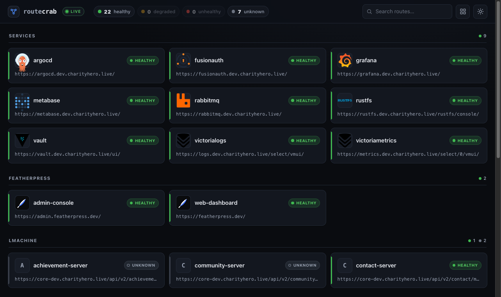
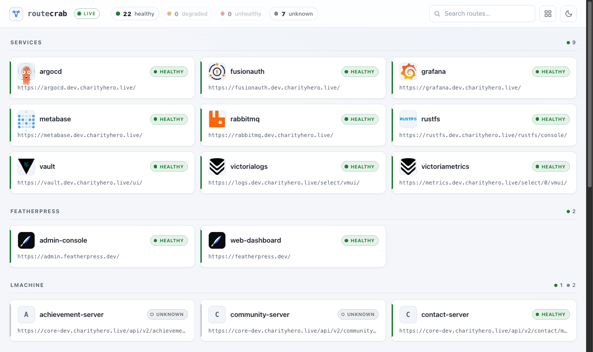
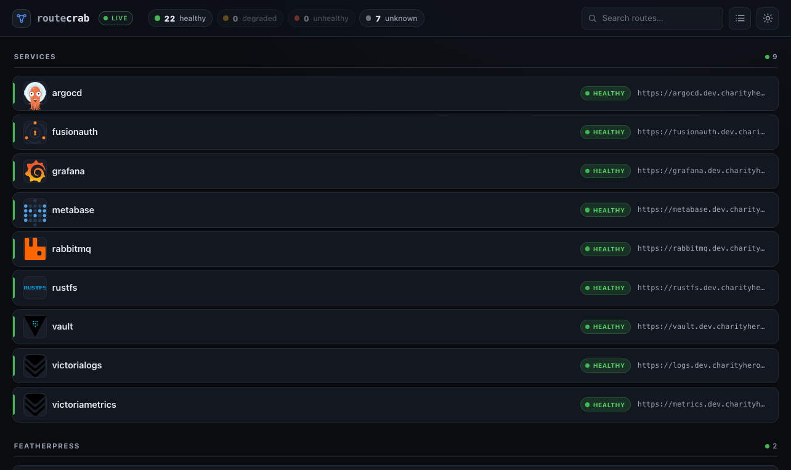
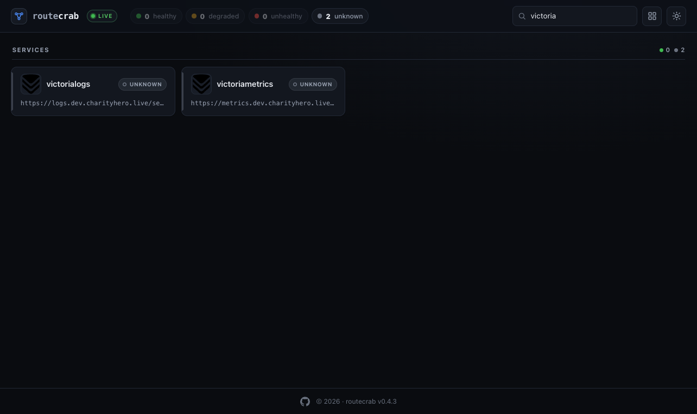

# routecrab

[](https://github.com/qveensi/routecrab/actions/workflows/ci.yml)
[](https://github.com/qveensi/routecrab/releases)
[](LICENSE)
[](https://github.com/qveensi/routecrab/pkgs/container/routecrab)

A Kubernetes-native dashboard that auto-discovers Gateway API `HTTPRoute` resources, health-checks them, and serves a real-time board with SSE live updates.

Most route dashboards require static configuration. routecrab uses the Gateway API as its source of truth: any `HTTPRoute` in the cluster appears on the board automatically, labelled with health status, grouped by namespace or annotation, and filterable by name. It produces structured JSON logs and Prometheus metrics so it fits naturally into existing observability stacks.

## Screenshots

| Dark mode | Light mode |
|:---:|:---:|
|  |  |
| **List view** | **Search** |
|  |  |

## Features

- **Gateway-API-first discovery** — watches `HTTPRoute` resources cluster-wide; no static config required.
- **Live health checks** — polls each route's URL at a configurable interval; statuses are `healthy`, `degraded`, `unhealthy`, or `unknown`.
- **Real-time board** — htmx + SSE push updates to open browser tabs without polling.
- **Annotation-driven metadata** — override title, description, group, display order, icon slug, and more with `routecrab.io/*` annotations on the HTTPRoute.
- **Client-side service icons** — service icons loaded client-side from [dashboard-icons](https://github.com/homarr-labs/dashboard-icons) (homarr-labs); set `routecrab.io/icon` to a slug or full URL. Unresolved icons fall back to a letter monogram.
- **Namespace filtering** — allow/deny lists control which namespaces are included.
- **Structured logs** — plain text (default) or JSON (`ROUTECRAB_LOG_FORMAT=json`).
- **Prometheus metrics** — `routecrab_routes_total`, `routecrab_routes_by_health{status=...}`, plus axum HTTP metrics.
- **Distroless image** — runs as nonroot uid 65532; chart enforces PSS-restricted policy.
- **Helm chart** — includes RBAC, optional ServiceMonitor/PodMonitor, PodDisruptionBudget, HTTPRoute, and Ingress toggles.

## Quick Start

### Helm (OCI chart)

```bash
helm install routecrab oci://ghcr.io/qveensi/helm/routecrab \
  --namespace routecrab --create-namespace
kubectl port-forward -n routecrab svc/routecrab 8080:80
```

Open [http://localhost:8080](http://localhost:8080).

### Helm (HTTP repo)

Prefer a classic chart repository over OCI:

```bash
helm repo add routecrab https://qveensi.github.io/routecrab
helm repo update
helm install routecrab routecrab/routecrab \
  --namespace routecrab --create-namespace
```

### Docker

```bash
docker run --rm -p 8080:8080 ghcr.io/qveensi/routecrab:latest
```

Multi-arch image (`linux/amd64`, `linux/arm64`), distroless, ~15 MB.

### Helm (local chart)

```bash
helm install routecrab deploy/helm/routecrab \
  --namespace routecrab --create-namespace
kubectl port-forward -n routecrab svc/routecrab 8080:80
```

### Common values

```yaml
# values-override.yaml
env:
  - name: ROUTECRAB_LOG_FORMAT
    value: "json"
  - name: ROUTECRAB_TITLE
    value: "My Cluster"
  - name: ROUTECRAB_NAMESPACE_ALLOWLIST
    value: "production,staging"

serviceMonitor:
  enabled: true
  labels:
    release: prometheus
```

```bash
helm install routecrab deploy/helm/routecrab \
  -f values-override.yaml \
  --namespace routecrab --create-namespace
```

## Annotations

Attach `routecrab.io/*` annotations to any `HTTPRoute` to control how it appears on the board.

| Annotation | Type | Default | Effect |
|---|---|---|---|
| `routecrab.io/title` | string | — (falls back to resource name) | Display title on the card |
| `routecrab.io/description` | string | — | Short description shown under the title |
| `routecrab.io/group` | string | namespace name | Group heading to place the card under |
| `routecrab.io/icon` | string | — | dashboard-icons slug (e.g. `argo-cd`) or full image URL; icon loaded client-side |
| `routecrab.io/url` | string | derived from first host + path | Clickable URL on the card |
| `routecrab.io/order` | i32 | `0` | Sort order within a group (lower = earlier) |
| `routecrab.io/hidden` | `"true"` | — | Set `"true"` to hide the route from the board |
| `routecrab.io/health` | `"false"` | — | Set `"false"` to disable health monitoring for this route |
| `routecrab.io/health-url` | string | — | Full URL to probe for health; overrides the public URL |
| `routecrab.io/health-path` | string | — | Path to probe on the public URL's origin |

Full reference: [docs/annotations.md](docs/annotations.md).

## Configuration

routecrab is configured entirely through environment variables.

| Variable | Default | Description |
|---|---|---|
| `ROUTECRAB_PORT` | `8080` | TCP port to listen on |
| `ROUTECRAB_ADDRESS` | `0.0.0.0` | Bind address |
| `ROUTECRAB_TITLE` | `routecrab` | Dashboard title shown in the header |
| `ROUTECRAB_LOG_LEVEL` | `info` | Log level (`trace`, `debug`, `info`, `warn`, `error`) |
| `ROUTECRAB_LOG_FORMAT` | `text` | Log format (`text` or `json`) |
| `ROUTECRAB_HEALTH_ENABLED` | `true` | Enable background health checking |
| `ROUTECRAB_HEALTH_INTERVAL` | `30s` | Interval between health checks (humantime, e.g. `30s`, `5m`) |
| `ROUTECRAB_HEALTH_TIMEOUT` | `5s` | Per-request timeout for health checks |
| `ROUTECRAB_NAMESPACE_ALLOWLIST` | _(empty = all)_ | Comma-separated namespace allowlist |
| `ROUTECRAB_NAMESPACE_DENYLIST` | `kube-system,kube-public,kube-node-lease` | Comma-separated namespace denylist |
| `ROUTECRAB_METRICS_ENABLED` | `true` | Serve Prometheus `/metrics` on the dedicated metrics port |
| `ROUTECRAB_METRICS_PORT` | `9090` | Port for the metrics listener (separate from the app port) |
| `ROUTECRAB_METRICS_ADDRESS` | `0.0.0.0` | Bind address for the metrics listener |

Full reference: [docs/configuration.md](docs/configuration.md).

## RBAC

The Helm chart creates a `ClusterRole` and `ClusterRoleBinding` that grant `list` and `watch` on `httproutes.gateway.networking.k8s.io`. No other permissions are required. The chart also creates a dedicated `ServiceAccount` (configurable via `serviceAccount.*` values).

## Endpoints

**Board & API (default port `8080`, `ROUTECRAB_*`)**

| Path | Method | Description |
|---|---|---|
| `/` | GET | HTML dashboard board (htmx + SSE); live-refreshes on any discovery/annotation/health change |
| `/api/routes` | GET | JSON array of all non-hidden routes |
| `/events` | GET | SSE stream for live board updates |
| `/healthz` | GET | Liveness/readiness probe — returns `200 ok` |

**Metrics (separate port `9090`, `ROUTECRAB_METRICS_*`)**

| Path | Method | Description |
|---|---|---|
| `/metrics` | GET | Prometheus text exposition (served on dedicated metrics port; disable with `ROUTECRAB_METRICS_ENABLED=false`) |

## Image

```
ghcr.io/qveensi/routecrab:<tag>
```

Distroless base, nonroot uid 65532, read-only root filesystem. MSRV: Rust 1.88 (edition 2021).

## Verifying signatures

Release images and the OCI Helm chart are signed with [cosign](https://github.com/sigstore/cosign) keyless signing (Sigstore) in CI — no long-lived keys. Verify with the GitHub Actions OIDC identity:

```bash
IDENTITY='^https://github.com/qveensi/routecrab/.github/workflows/release.yml@refs/tags/'
ISSUER='https://token.actions.githubusercontent.com'

# Image
cosign verify ghcr.io/qveensi/routecrab:latest \
  --certificate-identity-regexp "$IDENTITY" \
  --certificate-oidc-issuer "$ISSUER"

# Helm chart (replace <version>)
cosign verify ghcr.io/qveensi/helm/routecrab:<version> \
  --certificate-identity-regexp "$IDENTITY" \
  --certificate-oidc-issuer "$ISSUER"
```

## License

MIT — see [LICENSE](LICENSE).
